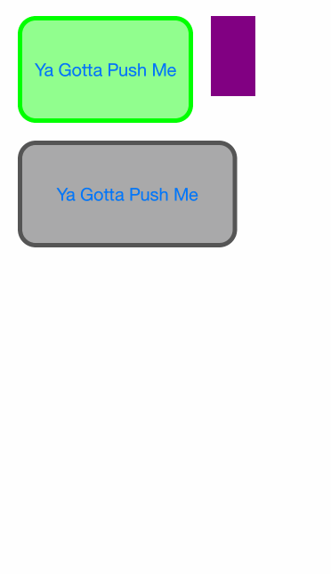

# Expanding Popover-ish View Controller

I needed a slick and minimal way to display popover-like view controllers that could shrink and expand based on their contents, and I figured it would be fun to experiment with the new container view controller methods to see if I could get the results I wanted. Turns out, the answer is yes!

This expanding view controller behaves kind of like a popover, in the sense that it contains multiple sub view controllers and only controls a small area of the screen. There's the initial view controller — the one that the user sees by default — and the expanded view controller, which is triggered by an action from the initial view controller. The expanding view controller changes its size depending on the preferred content size of its child view controllers, and can change dynamically if the preferred content size of its children changes. Everything runs on autolayout, so if you structure your code correctly, you can create a UI that's able to dynamically reposition itself based on the expansion and contraction of its expanding view controllers. Be warned that there's a lot of container view controller methods that I haven't implemented, so behavior may be erratic.

Code is in an early state. Not sure if I'm ever going to polish it up to production level — though I will, of course, still use it for my own half-baked productions!